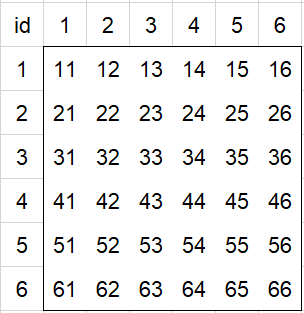

# 夏末-宗长计算器

#### 介绍
夏末-宗长计算器 summerendffxiv.club-foxcalculator

根据绝杀宗长表格数据构建的快速查询计算器

#### 算法

架构：非常非常原始的前端三件套

原表格共16组数据，数据分为4组（A、B、C、D）之后旋转4个方向，由此可以简化计算逻辑。

6✖️6的按钮组的ID定义规则：

在html中根据从左到右，从上到下的顺序，依次将按钮ID定义为11->66，对应坐标(1，1)->(6，6)，后续只需要进行除法和取余就能获取坐标值，如34/10=3，34%10=4.

随后根据固定点判断是哪个数据组，定义：A组⬆️ = A_u；D组⬅️ = D_l。固定点见：plugins.js 15-30行。

